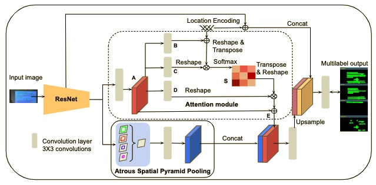
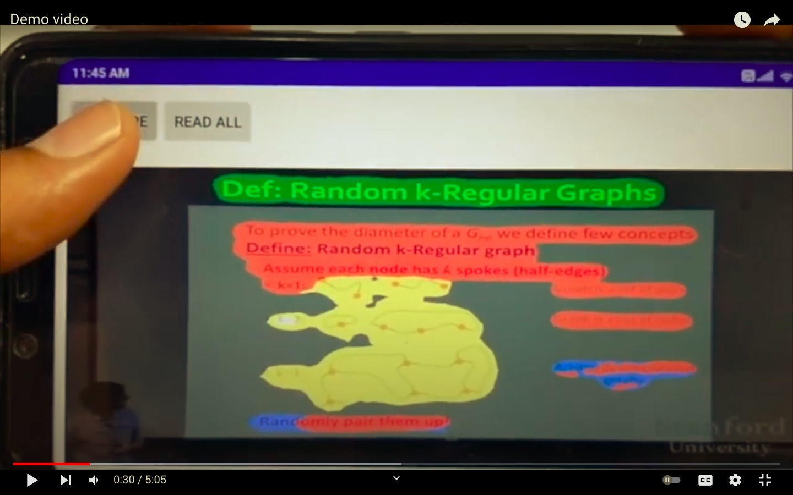

## LEANet: Official Project Webpage
Location encoded attention module that utilizes the location encoding of logical regions of slide image.

<p align="center">

<em>
<p>The architecture of the proposed classroom slide segmentation network for classroom slide segmentation. The network consists of three modules --- (i) attention module (upper dotted region), (ii) multi-scale feature extraction module (lower  region), (iii) feature concatenation module. Here, &oplus; and &otimes; represent the element-wise summation and multiplication of features, respectively.
</p></em>
</p>

This repository provides the official PyTorch implementation of the paper:
> **Classroom Slide Narration System** <br>
> Jobin K.V., Ajoy Mondal, and C. V. Jawahar<br>
> In CVIP 2021<br>

> **Abstract:** *Slide presentations are an effective and efficient tool used by the teaching community for classroom communication. However, this teaching model can be challenging for the blind and visually impaired (VI) students. The VI student required a personal human assistance for understand the presented slide. This shortcoming motivates us to design a Classroom Slide Narration System (CSNS) that generates audio descriptions corresponding to the slide content. This problem poses as an image-to-markup language generation task. The initial step is to extract logical regions such as title, text, equation, figure, and table from the slide image. In the classroom slide images, the logical regions are distributed based on the location of the image. To utilize the location of the logical regions for slide image segmentation, we propose the architecture, Classroom Slide Segmentation Network (CSSN). The unique attributes of this architecture differs from most other semantic segmentation networks. Publicly available benchmark datasets such as WiSe and SPaSe are used to validate the performance of our segmentation architecture. We obtained 9.54% segmentation accuracy improvement in WiSe dataset.  We extract content (information) from the slide using four well-established modules such as optical character recognition (OCR), figure classification, equation description, and table structure recognizer. With this information, we build a Classroom Slide Narration System (CSNS) to help VI students understand the slide content. The users have given better feedback on the quality output of the proposed CSNS in comparison to existing systems like Facebook’s Automatic Alt-Text (AAT) and Tesseract*<br>

## Demo Video
Click the figure to watch the youtube video of our paper!
<p align="center">
<a href="https://youtu.be/PnPYrA8ykF0"></a><br>
</p>

## Pytorch Implementation
### Installation
Clone this repository.
```
git clone git@github.com:jobinkv/CSNS.git
cd CSNS/CSSN
```
Install following packages.
```
conda create --name leanet python=3.6
conda activate leanet
conda install -y pytorch=1.4.0 torchvision=0.5.0 cudatoolkit=10.1 -c pytorch
conda install scipy==1.4.1
conda install tqdm==4.46.0
conda install scikit-image==0.16.2
pip install tensorboardX==2.0
pip install thop
```
### Datasets
We evaludated CSSN on [WiSe](https://cvhci.anthropomatik.kit.edu/~mhaurile/wise/) and [SPaSe](https://cvhci.anthropomatik.kit.edu/~mhaurile//spase/).<br>
The files and make the directory structures as follows.
```
spase
|-- img
`-- labels

wise
|-- img
`-- labels
```

You should modify the path in **"<path_to_cssn>/config.py"** according to your WiSe and SPaSe dataset path.
```
#Dir Location
__C.DATASET.WISE_DIR = '/ssd_scratch/cvit/jobinkv/wise'
__C.DATASET.SPASE_DIR = '/ssd_scratch/cvit/jobinkv/spase'
```

#### All models trained for our paper
You can download all models evaluated in our paper at [One Drive](https://iiitaphyd-my.sharepoint.com/:f:/g/personal/jobin_kv_research_iiit_ac_in/EuAOiunVn05ErqNr3S_VxXIBaSxq45DHidtjG1z1zdKFqg?e=xb22UG)

#### ImageNet pretrained ResNet-101 which has three 3×3 convolutions in the first layer
To train ResNet-101 based HANet, you should download ImageNet pretrained ResNet-101 from [this link](https://iiitaphyd-my.sharepoint.com/:u:/g/personal/jobin_kv_research_iiit_ac_in/EdEMPBOhuM9FisCUKxQ-gYoBk9Fvv3RLpYyDg7O_tQsEsQ?e=KfcH9K). Put it into following directory.
```
<path_to_cssn>/pretrained/resnet101-imagenet.pth
```
This pretrained model is from [MIT CSAIL Computer Vision Group](http://sceneparsing.csail.mit.edu/)

## Citation
If you find this work useful for your research, please cite our paper:
```
@InProceedings{Jobin_2021_CVIP,
author = {Jobin K.V., Ajoy Mondal, and C. V. Jawahar},
title = {Classroom Slide Narration System},
booktitle = {Conference on COMPUTER VISION and IMAGE PROCESSING (CVIP)},
month = {December},
year = {2021}
}
```

