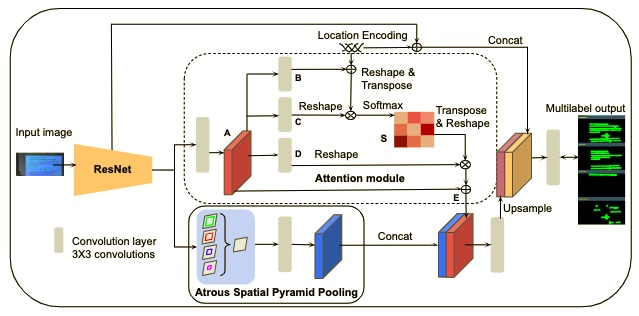

## LEANet: Official Project Webpage
Location encoded attention module that utilizes the location encoding of logical regions of slide image.

<em>

The architecture of the proposed classroom slide segmentation network for classroom slide segmentation. The network consists of three modules --- (i) attention module (upper dotted region), (ii) multi-scale feature extraction module (lower  region), (iii) feature concatenation module. Here, &oplus; and &otimes; represent the element-wise summation and multiplication of features, respectively.

</em>

This repository provides the official PyTorch implementation of the paper:
> **Classroom Slide Narration System**  
> Jobin K.V., Ajoy Mondal, and C. V. Jawahar 
> In CVIP 2021 

> **Abstract:** *Slide presentations are an effective and efficient tool used by the teaching community for classroom communication. However, this teaching model can be challenging for the blind and visually impaired (VI) students. The VI student required a personal human assistance for understand the presented slide. This shortcoming motivates us to design a Classroom Slide Narration System (CSNS) that generates audio descriptions corresponding to the slide content. This problem poses as an image-to-markup language generation task. The initial step is to extract logical regions such as title, text, equation, figure, and table from the slide image. In the classroom slide images, the logical regions are distributed based on the location of the image. To utilize the location of the logical regions for slide image segmentation, we propose the architecture, Classroom Slide Segmentation Network (CSSN). The unique attributes of this architecture differs from most other semantic segmentation networks. Publicly available benchmark datasets such as WiSe and SPaSe are used to validate the performance of our segmentation architecture. We obtained 9.54% segmentation accuracy improvement in WiSe dataset.  We extract content (information) from the slide using four well-established modules such as optical character recognition (OCR), figure classification, equation description, and table structure recognizer. With this information, we build a Classroom Slide Narration System (CSNS) to help VI students understand the slide content. The users have given better feedback on the quality output of the proposed CSNS in comparison to existing systems like Facebook’s Automatic Alt-Text (AAT) and Tesseract* 